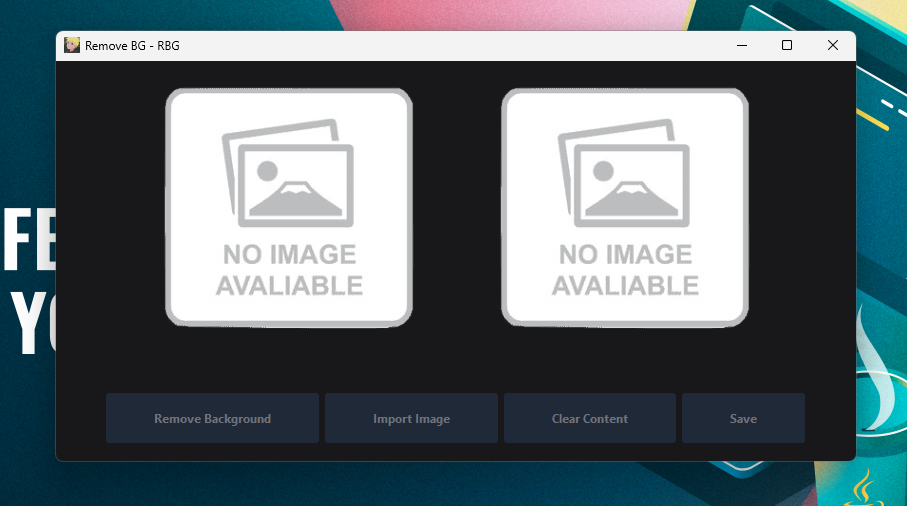

# Trabalho de Computação Gráfica
## Integrantes

| Nome | Curso | Matrícula |
| :--: | :--: | :--: |
| Arthur Bueno Silva | Engenharia de Computação | 1818 |
| Pedro Augusto Barbosa Aparecido | Engenharia de Software | 170 |
## Como utilizar o app

Para poder utilizar da técnica de remoção de fundo, foi desenvolvido uma aplicativo desktop
para que fique simples de se utilizar. Para poder executá-lo, precisa apenas ter o **Python 3.11.5** instalado na máquina e seguir os seguintes passos:

#### Ter um ambiente virtual criado e ativado
```shell
> python -m venv venv
> ./venv/Scripts/Activate.ps1
```

#### Instalar as dependências
```shell
> pip install -r requirements.txt
```

#### Rodar o arquivo **main.py** dentro do ambiente virtual
```shell
> python app/main.py

# ------ OU ------

> cd ./app && python main.py
```

#### Outra alternativa
Também poderá baixar o app diretamente do **GitHub** se preferir clicando [aqui](https://github.com/Pedro-Augusto-Barbosa-Aparecido/trabalho-de-cg/releases/tag/v1.0.0)


### Utilização do aplicativo

O aplicativo tem quatro funções, nas quais são:

### Remove Background
Nessa função se tiver uma imagem para ser removido o fundo ele irá remover e mostrar no preview da direita.

### Import image
Nessa você irá escolher a imagem que irá importar para remover o fundo.

### Clear Content
Esta função irá limpar o conteúdo dos previews e o que foi importado

### Save
Nessa irá salvar a imagem onde desejar.



